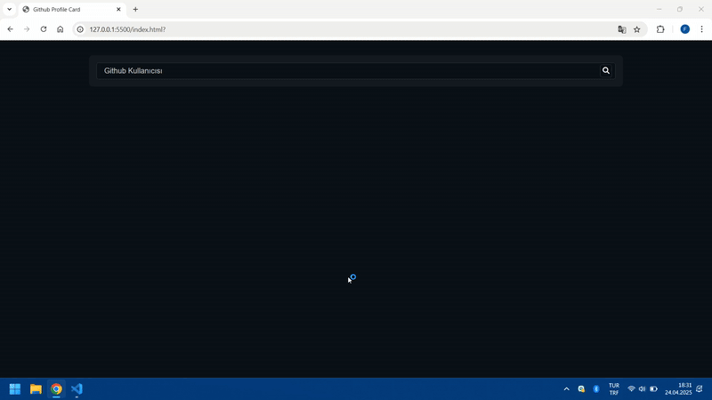

# Github-Profile_Cart

Bu proje, bir kullanıcının GitHub profil verilerini GitHub API'ı üzerinden alarak şık bir profil kartı olarak gösteren basit bir web uygulamasıdır.

<h2>Özellikler</h2>

🔍 Kullanıcı adı ile GitHub profil bilgilerini alma

📊 Takipçi sayısı, repolar, takip edilenler gibi bilgilerin gösterimi

🖼️ Profil fotoğrafı, bio ve lokasyon gibi bilgilerin şık kart görünümünde sunulması

⚡ Hızlı ve sade arayüz

🛠️ <h2>Kullanılan Teknolojiler</h2>

HTML5

CSS3 (veya Tailwind / Bootstrap kullandıysan belirt)

JavaScript (veya React / Vue vs.)

GitHub REST API

